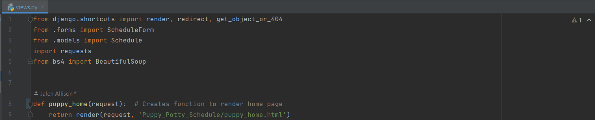
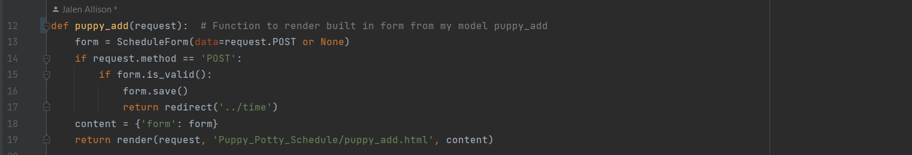
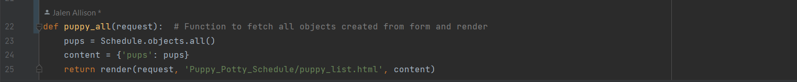
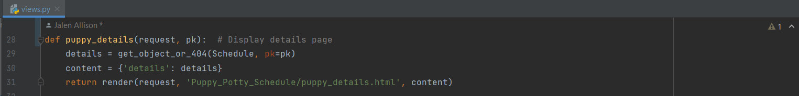
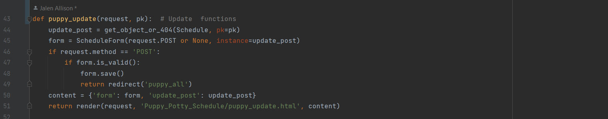
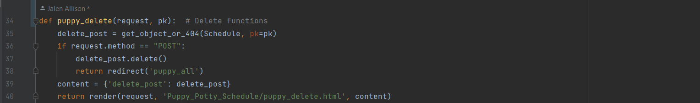

# Puppy potty schedule app using Python/Django

# Introduction
During this sprint, I built the front end and back end of an app that allows you to use CRUD functionality to keep track of your puppy's potty schedule using python and Django framework. The IDE used was PyCharm. There were different stories describing the tasks that needed to be completed for the app through Azure DevOps. There were daily stand-ups with other developers discussing roadblocks, what we worked on yesterday, and what we will be working on that day.

Below are descriptions of the stories that were worked on and finished. Theres seperate screenshots of the code associated and how the app looks and works.

# Project

### Story 1: Create a new app for the project, named appropriately for what you are tracking, and get it to display a home page with basic content.
## Home page .png)
## Code for home page  
    
### Story 2: Create a model for the collection item you will be tracking and add the ability to create a new item.
## Create page .png)
## Code for create/adding  

### Story 3: Display information from the database in a page.
## List page .png)
## HTML List Code 
## Code for displaying database  

### Story 4: Create a details page that will show the details of any single item from within the database, as selected by the user. Link this to the index page for each item.
## Details page .png)  
## HTML Details Code 
## Code for the puppy details   
    
### Story 5: Allow for edits and delete functions to be done from the details page or from separate pages. Have confirmation before deleting.
## Update/edit page .png) 
## Code for update/edit 
## Confirm delete page .png) 
## Code for confirm delete 
 

### Skills Learned
My main hurdle that I learned from was that nothing should be named the same thing as your model or the computer wont understand what you're trying to call to function. Plus, it also gets confusing on my end when I'm looking through my code and the same name is being used for different functions or labels especially when there is an error.
Working on a deadline and having daily standup taught me how to stay on schedule and adhere to the work schedule I set out to for the day or having to make the neccessary adjustments if my original timeline didnt go as planned. 
